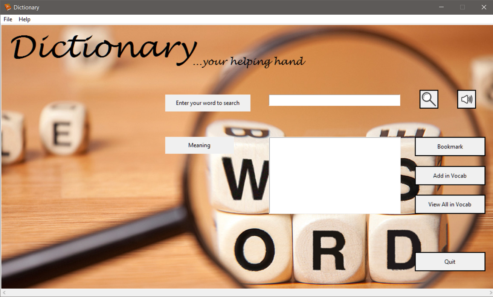
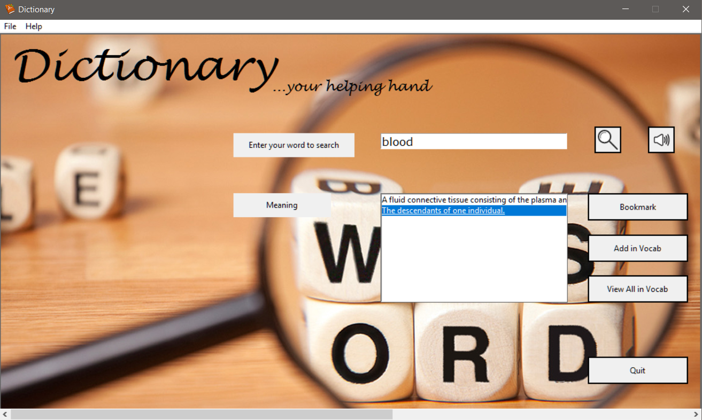
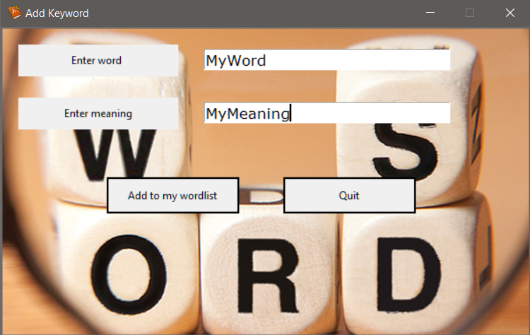
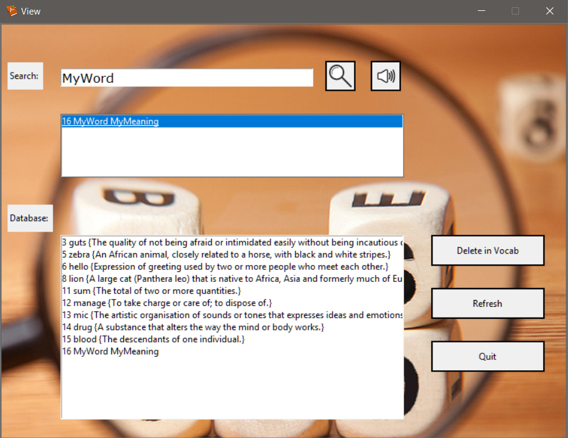

# Dictionary
It is an offline Python GUI application which has all the basic features that a dictionary software must have. You can search meaning of a word which is parsed from the JSON file, bookmark it in your own database, add your own word with its meaning, and can delete the existing word from the database.

UI of the Application:

First look:     

      
Working:     

     
Add your own word:   

     
View database:        

